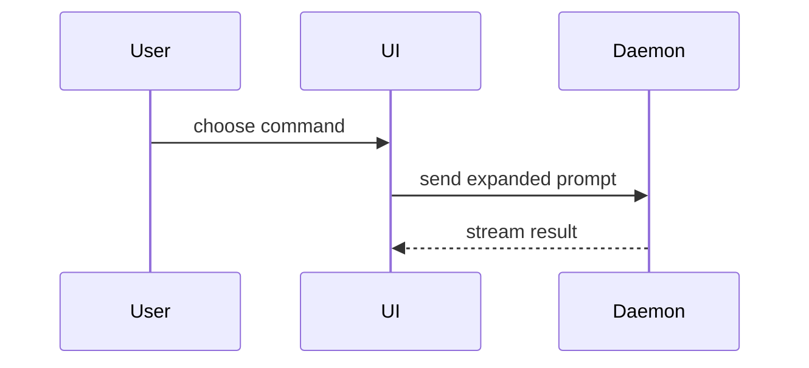

## Before opening

- **Branch off `main`**, never off another feature branch unless you are deliberately stacking. Check with `git log --oneline origin/main..HEAD` that every commit belongs to this change.
- **Small, ordered commits.** Rebase into commits that each build and tell the story in order: failing repro or test before the fix, scaffold before fill-in. Amend when a fix belongs in a just-made commit.
- **Review first.** Run `/code-review` against `main` and fix every **Act on** finding.
- **Prefer several narrow PRs to one large one.** For a stack, the root PR targets `main` and each child PR targets its parent's branch (`gh pr create --base <parent-branch>`).

## Title

Conventional Commits: `type(scope): subject`. Types: `feat`, `fix`, `docs`, `refactor`, `test`, `chore`, `perf`. Scope is the area: `api`, `web`, `db`, `infra`, `ingest`, `skills`. Imperative subject, no trailing period, name a real symbol when one carries the change. The repo squash-merges, so the title becomes the commit subject on `main`.

## Opening

`gh pr create --base main --title "..." --body-file <file>`. Open it ready, never draft. Opening a PR does not mean babysitting it: post the URL and move on unless asked to drive it to merge.

## Body

Use this template for writing the PR body. Drop a section that has nothing to say, except Scope and Evidence, which are always present.

```markdown
## Summary

<one to three sentences: why this change exists, then the smallest visual: diagram, diff-sketch, or tree>

Closes #<issue>

## Scope

<what this covers, and what it deliberately leaves out: follow-ups, known gaps>

## Evidence

- **Before:** <screenshot/output/failing test run>
  **After:** <screenshot/output/passing test run>

## Merge Danger

**Door:** <one-way or two-way>

<optional: description>

**Blast Radius:** <one-word description>

<optional: potential ramifications of merge>
```

## Sections

Skip all preambles and keep prose brief. Use the user's domain language from `GLOSSARY.md`.

### Summary

Pick the smallest view that makes the key point clear.

- Show logic or an algorithm as pseudocode:

```text
on(save)
  if content is unchanged
    return cached result
  write new content
  return fresh result
```

- Show runtime control flow as a call tree:

```text
submitForm
  createSession
    persistPrompt
    launchAgent
  navigateToSession
```

- Show UI structure as a component tree, including state and module boundaries that matter:

```text
<SessionPage> (apps/example/src/routes/session.tsx)
  useSessionEvents()
  <SessionToolbar>
    <RunSkillButton> (packages/ui)
```

- Show file responsibility or a broad refactor as a shallow file tree:

```text
src/
├── commands/       # parses user actions
├── sessions/       # owns session state
└── transport/      # sends API requests
```

- Show component interaction, control flow, or data flow with Mermaid:



- Use `diff` when the point is what changes and the surrounding shape already exists. Match the diff shape to the topic.

For a component change:

```diff
 <SessionPage>
   useSessionEvents()
   <SessionToolbar>
+    <RunSkillButton />
   <SessionTimeline>
+    <SkillResultCard />
```

For a file-layout change:

```diff
 src/
 ├── commands/
+│   └── show-me.ts       # expands the slash command
 ├── sessions/
-└── transport.ts
+└── transport/
+    ├── client.ts
+    └── stream.ts
```

For a call-tree or call-stack change:

```diff
 submitForm
   createSession
     persistPrompt
+    expandSkillMention
     launchAgent
-  navigateToSession
+  navigateToSession
+    subscribeToEvents
```

For a state or control-flow change:

```diff
 on(save)
-  write content
+  if content is unchanged
+    return cached result
+  write new content
+  invalidate cache
```

- Show the whole block when most of it is new, when omitted context would hide ownership or order, or when the user needs a copyable target shape:

```ts
function expandSkill(command: string): string {
  const skillName = command.slice(1);
  return `use the ${skillName} skill`;
}
```

#### Guidance

Place each visual next to the short text it supports. Keep only the calls, files, props, states, and boundaries needed to answer the user's current question or the options to resolve the current discussion point.

You may use one of these, you may use several, it is unlikely you will use all of them. Use your judgement and don't overwhelm the user.

### Evidence

Concrete evidence that the change works. Show a before and after. Each item names a real run path (a command, a URL, a test) and its outcome; "typecheck passes" alone is not evidence of behavior. If something could not be verified, say so and why. Use the rungs from `almalgo-mode`'s `verify.md`.

Screenshots are S-tier - when the environment is set up for it and the change is visual.

Execution-based evidence is A-tier. Test results, console output. Show the exact test that now fails and passes, using pseudocode.

### Merge Danger

Describe whether it's a one-way or two-way door. You can walk back through two-way doors, but not one-way doors. A PR that is cheap to roll back is lower risk. Changes that involve destructive actions or hard-to-reverse decisions are one-way doors.

The blast radius is the potential impact or scope of the changes introduced by this PR. Consider all possibilities. Examples are layout shift, breakages for consumers, mobile responsiveness, etc. Always check the project-specific risks listed in `docs/agents/verify.md` under "Merge danger checklist".

### Not in the body

No SHAs, no file-by-file checklists, no rebase history, no "based on main" preamble. A reviewer with the diff should learn why, what is out of scope, what could break, and how it was proven, in under a minute.
